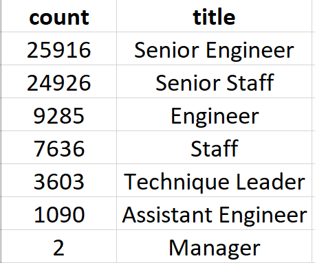
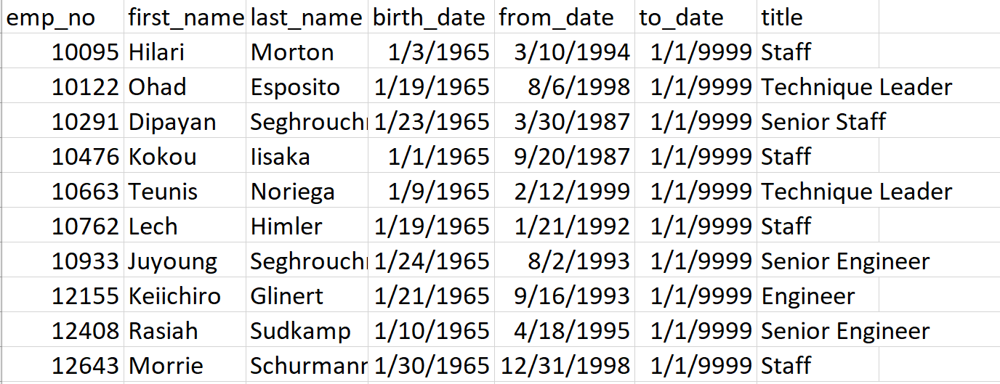

# Pewlett-Hackard-Analysis

## Overview
The purpose of this analysis was to use SQL to gather data for a large tech 
company's incoming retiring population or the "silver tsunami". The data 
created in this project informs the company how many positions per department 
needs to be filled and how many retiring employees are eligible to participate 
in a mentorship program.

## Results

* There are over 72,000 company employees retiring.
* The senior engineer and senior staff titles together need to fill over 
50,000 positions.  
* There are only two people retiring from the Manager's titles. 
*There are over 1,500 retiring employees eligible to participate in the 
mentorship program. 

## Summary